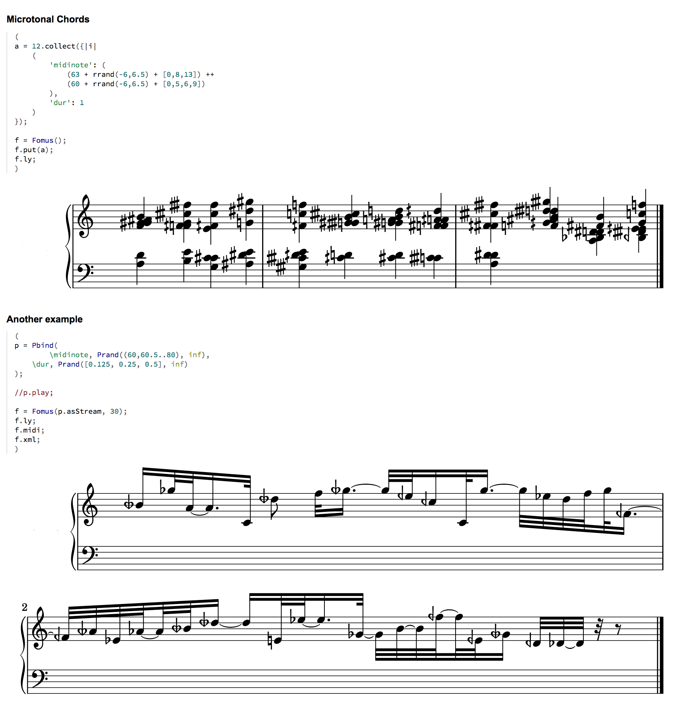

# SuperFomus

SuperCollider bindings to Fomus Music Notation (FOrmat MUSic).

``FOMUS is a open source software application by David Psenicka that automates many musical notation tasks for composers and musicians, facilitating the process of creating professionally notated scores by allowing the user to separate attributes such as times, durations and pitches from the representation of them in conventional music notation. [...] Once the composer loads or inputs their materials, FOMUS outputs a file suitable for importing into a graphical notation program such as LilyPond, MuseScore, Finale, Sibelius and others.''

See Help file for more information.

## Website

    https://github.com/smoge/superfomus

